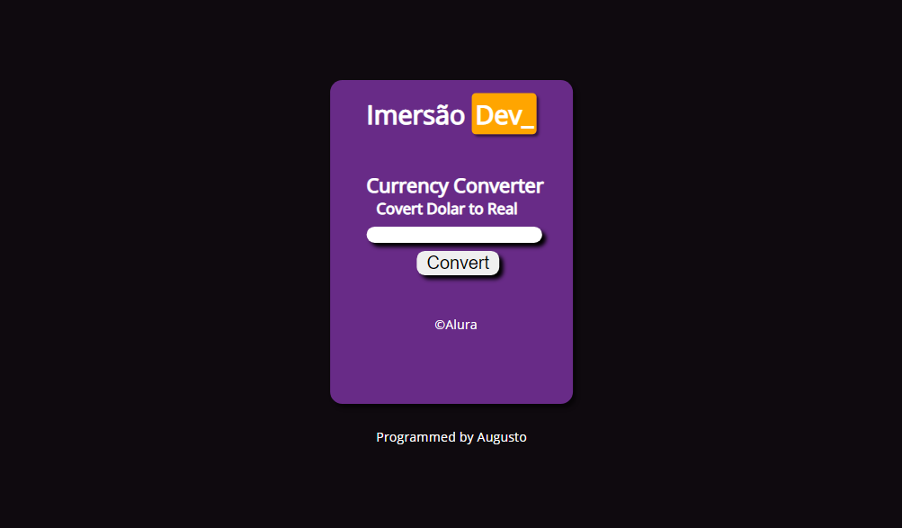
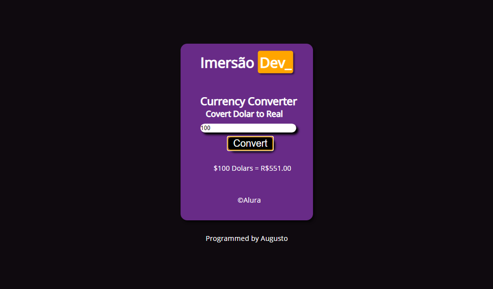

# About (Currency-Converter) 📝

This is a simple project from [ALURA](https://www.alura.com.br) they are making a free workshop to beginners from the 22nd of March to the 2nd of April.
Here is the first Currency Converter project, the challenge was to use Input to receive the value and display it using (InnerHTML).

# Design 🖥️

# Personal talk 💬

Thank you too much [ALURA](https://www.alura.com.br) to help us the beginners , i promise i will help other peoples like you . And if you are seeing this code and wanna study with me 
check the workshop [LINK](https://imersao.dev/aulas/aula01-conversor-moedas-variaveis)
